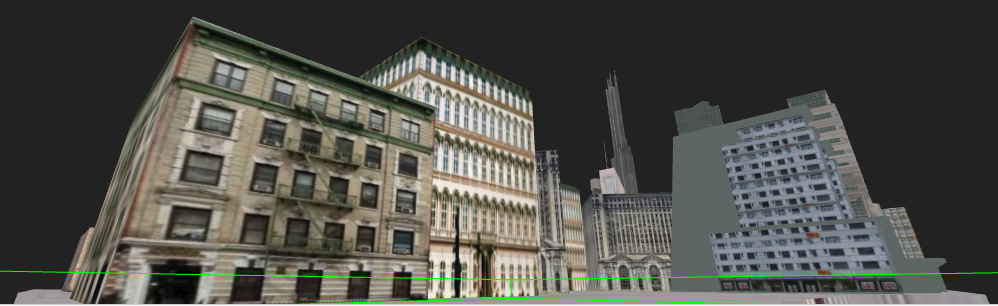
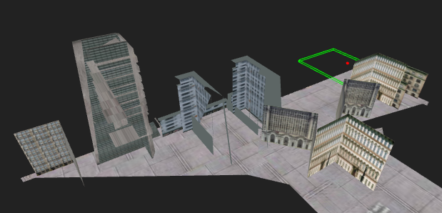

# Just-In-Time Geometry: Visibility Precomputation and 3D Asset Delivery on Demand

Consider how people would connect to a vast, unbounded virtual universe, like the [Oasis](https://www.youtube.com/watch?v=qqhxF2r8_fE) fictionalized in *Ready Player One*.  Should they download expansion packs periodically?  How long before their hard drives are full?  Is this even feasible on mobile devices?  Maybe they would receive a video stream and not need a 3D engine on their device.  Do they have enough bandwidth to receive 4k video (or whatever tomorrow brings) without lag?  What if an internet connection is not available?

One possible solution takes inspiration from the World Wide Web.  You probably can’t store the entire World Wide Web on your device, but your web browser caches the sites you actually visit, as you visit them.  The content is provided **on demand** with acceptably **low bandwidth** requirements, and you can **work offline** with cached content.

## Proof of Concept

This repository implements a simple proof of concept for on demand delivery of a 3D scene, and it should work with any recent web browser except Internet Explorer.  It targets laptops, desktops, or any other device with a keyboard and sizable display.

[LIVE DEMO](http://www.purdone.com/dave/visdemo/)

The geometry files used in the live demo are not part of this repository, but you can download them [here](http://www.purdone.com/dave/visdemo/geometry.zip).

[How to run things locally](https://threejs.org/docs/index.html#manual/en/introduction/How-to-run-things-locally)

### Problem Definition

Clients should receive 3D assets no later than when the camera is one time step away from being able to view the assets.  Sending more than necessary is okay as long as it doesn’t exceed the available bandwidth, but sending less is never acceptable because users will notice holes in objects.

For example, here is a first person view of a city scene.

From a third person view, we can see that only geometry visible from the first person vantage is present, but the first person viewer can’t tell that anything is missing.

### The Secret Sauce: Visibility Precomputation

In this demo, the world is subdivided into non-hierarchical volumes outlined by green boxes.  In practical terms, the basic problem is to compute which mesh faces are visible from each volume and to transmit the visible faces for a given volume before the camera moves into that volume.

How this happens is the interesting part of the problem.  I performed this computation offline using a **patent pending** process and used the results to create the [glTF](https://www.khronos.org/gltf/) files used in the demo.  I am interested in working with game developers to determine if this process can scale up for commercial viability.

If you have a project for which this technique might be useful, you’re welcome to [contact me](http://www.purdone.com/dave/contact.php).  I am particularly interested in hearing from people who work on game engines, including plug-ins, and people who work to get 3D assets into games.

### Limitations of the Demo

Please remember that this is a proof of concept.  My only intent is to demonstrate the visibility precomputation and just-in-time paradigm.

* You are likely to notice a “hiccup” when moving from one green box to another.

[Three.js](https://threejs.org/), which I used for WebGL, seems to require loading new geometry on the user interface thread.  (Please contact me if this is wrong, or submit a pull request.  See the *webworkers* branch for prospective fixes I’ve already tried.)  In production, loading new geometry should occur in the background.

* All content is served statically.

As a consequence, a lot of geometry is sent multiple times because it is visible from many volumes.  This increases the total data transmission size, and you might notice a slow down as you walk around the scene due to the extra computation required to process the duplicates (overdraw).

Each glTF file contains the geometry visible from an associated box minus the geometry visible from the initial box.  In production, content should be served dynamically.  The server session should maintain a record of which volumes the user has already visited, and it should not resend any of the geometry visible from any of those volumes.

* The demo shouldn’t work with Internet Explorer because that browser doesn’t support JavaScript modules.

* You will observe [Z-fighting](https://en.wikipedia.org/wiki/Z-fighting) because the city model I used has overlapping geometry.  This is not related to my method for visibility precomputation.

## Conclusion

Please read the wiki, including [Further Investigation](https://github.com/kalbfled/jit-geometry/wiki/Further-Investigation) and the [FAQ](https://github.com/kalbfled/jit-geometry/wiki/FAQ), which discusses Google Stadia, using visibility precomputation to reduce overdraw, and other relevant topics.

Thanks to [Herminio Nieves](https://www.cgtrader.com/herminio) for providing the [city model](https://free3d.com/3d-model/the-city-39441.html).
